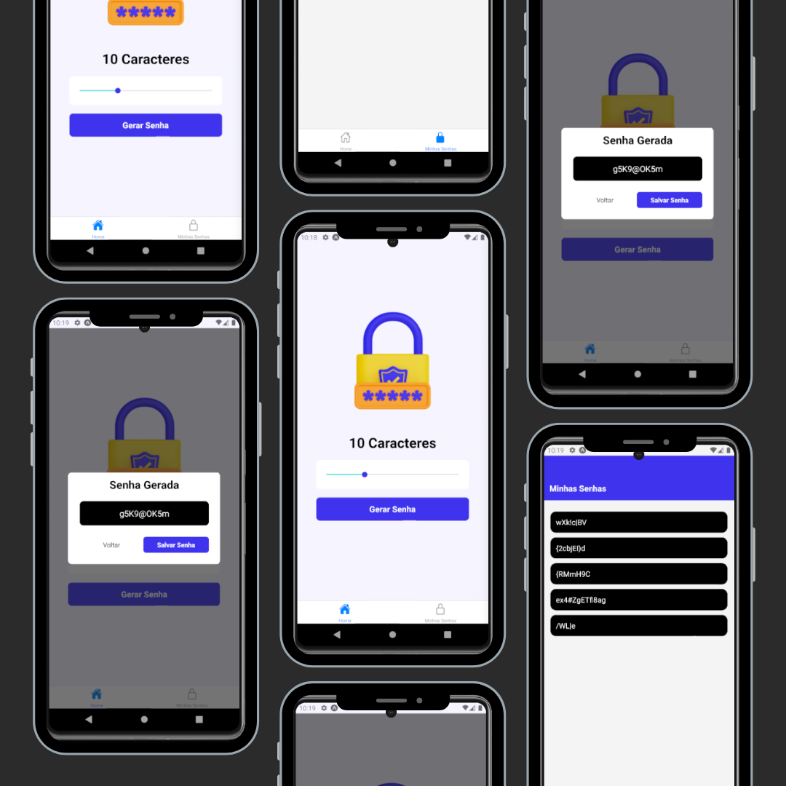

## Screenshots



# App Password Generator

Este é um aplicativo para gerar e salvar senhas aleatórias de forma rápida.

### ℹ️ Sobre o Aplicativo

O App Password Generator foi desenvolvido para criar senhas fortes e aleatórias para uso em diferentes contextos, fornecendo uma ferramenta fácil de usar para garantir a segurança das suas contas online.

### 🚀 Funcionalidades

Geração de senhas seguras com opção de salvar para ver depois.
Escolha do comprimento das senhas.
Inclusão de letras maiúsculas, minúsculas, números e caracteres especiais.

### 💻 Tecnologias e Bibliotecas Utilizadas

React Native

**Bibliotecas Utilizadas:**

- AsyncStorage para realizar o armazenamento local das senhas geradas
- ReactNavigation + BottomTabNavigator para exibir um menu inferior e realizar navegações entre páginas.

### ▶️ Como Utilizar

Faça um clone deste repositório.
Instale as dependencias
Confira se voce tem o AndroidStudo para rodar o emulador

Para rodar, rode o seguinte comando

```bash
  npx expo start
```

Escolha a quantidade de caracteres desejadas para a senha e clique em "Gerar Senha".

### 🤝 Contribuição

Contribuições são sempre bem-vindas! Sinta-se à vontade para abrir uma issue ou um pull request para melhorias no aplicativo.
